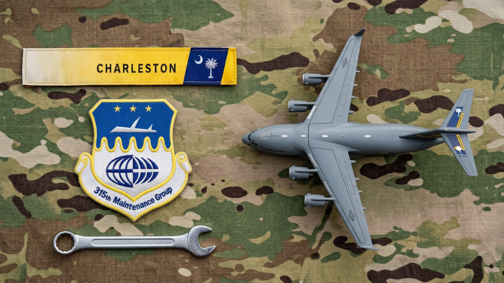

# ✈️ 315th Maintenance Group (315 MXG) Theme for Omarchy

A tactical military aviation theme for [Omarchy](https://omarchy.org), inspired by the **315th Maintenance Group (315 MXG)** of the 315th Airlift Wing stationed at Joint Base Charleston, South Carolina.

Built around the C-17 Globemaster III maintenance flight line, featuring an authentic OCP MultiCam backdrop, Charleston tail flash gold, Air Force flight blue, tactical aircraft grey, and a tri-color gradient border in Hyprland and the Omarchy Shell.



---

## 🚀 Installation & Activation

### Local Activation (Already Installed)
Switch to the theme immediately:

```bash
omarchy theme set 315mxg
```

### Git Installation (For Other Machines)
If hosted on GitHub:

```bash
omarchy theme install https://github.com/jbrooksBot/omarchy-315MXG-theme.git
omarchy theme set 315mxg
```

---

## 🎨 Color Palette

| Name | Hex Code | Role |
|---|---|---|
| **Background** | `#11161c` | Deep Cockpit Gunmetal Night |
| **Foreground** | `#e2e8f0` | Crisp Avionics Instrument White |
| **Accent** | `#e5a910` | Charleston Flightline Gold / Amber |
| **Blue** | `#2563eb` | Air Force Heritage Blue |
| **Patch Navy** | `#1b4d89` | 315th MXG Emblem Deep Blue |
| **Selection** | `#1e3a5f` | Tactical Air Force Navy |
| **Tactical Grey** | `#94a3b8` | C-17 Globemaster III Airframe Grey |
| **Olive Drab** | `#5b8a5b` | MultiCam Woodland Green |
| **Coyote Earth** | `#8b6540` | OCP Earth Tan / Coyote Brown |
| **Alert Red** | `#dc3545` | Warning & Flightline Alert Red |

### 🪟 Window Borders (Hyprland & Omarchy Shell)
- **Active Window Border:** 45° Tri-Color Flight Line Gradient — Charleston Gold, Air Force Blue, and C-17 Tactical Grey:
  `rgba(e5a910ee) rgba(1b4d89ee) rgba(94a3b8ee) 45deg`
- **Inactive Window Border:** Muted Gunmetal Slate Gradient:
  `rgba(222a35aa) rgba(141920aa) 45deg`

---

## 🖼️ Included Wallpapers

Stored in `backgrounds/`:
1. **`1-clean-315-mxg-desktop.png`** — Original clean flatlay with MultiCam OCP camouflage, embroidered 315th Maintenance Group emblem, Charleston tail flash patch, C-17 aircraft, and maintainer's wrench.
2. **`2-flightline-night-maintenance.jpg`** — Twilight flightline maintenance at Joint Base Charleston: C-17 turbofan engine inspection with floodlights, tool chests, and maintainer crew.
3. **`3-c17-charleston-sunset.jpg`** — Golden hour aerial view of a C-17 Globemaster III banking over ocean cloud banks with the Charleston tail flash gleaming in the sunset.
4. **`4-315mxg-hangar-inspection.jpg`** — Inside the 315th Maintenance Group heavy hangar facility with multi-level yellow/blue docking stands, diagnostic stations, and LED floodlights.
5. **`5-c17-runway-headon.jpg`** — Gritty low-angle frontal shot of a C-17 taxiing on the runway under dramatic storm clouds with engine heat haze.
6. **`6-315mxg-patch-coyote-brown.jpg`** — Minimalist macro composition featuring the authentic embroidered 315th Maintenance Group cloth unit patch centered on a textured coyote brown ripstop fabric surface.

Cycle between them anytime in Omarchy with:
```bash
omarchy theme bg next
```

---

## 📄 License
[MIT](LICENSE)
